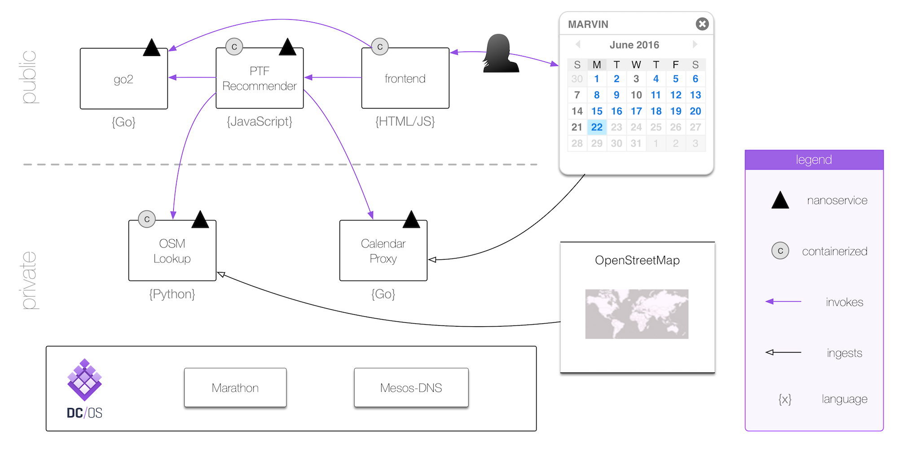
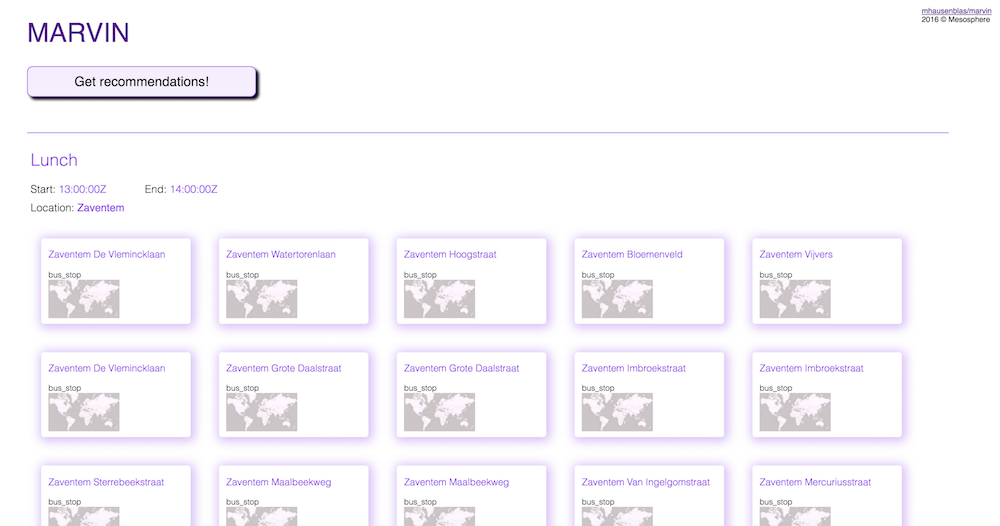

# MARVIN

MARVIN is a demonstrator for a nanoservices based application on DC/OS. He got his name from another famous [Marvin](http://hitchhikers.wikia.com/wiki/Marvin) …

## Concept & Architecture

MARVIN comprises:

1. a calendar proxy nanoservices [nS1](nS1/)
1. an OpenStreetMap lookup nanoservices [nS2](nS2/)
1. an public transport facilities (PTF) recommender nanoservices [nS3](nS3/)
1. a frontend, a NGINX-based Web app [frontend](frontend/)

Data sources used in MARVIN:

- a default [Google calendar](https://calendar.google.com/calendar/ical/r5sj91351jcgb0gul5h0tvou7o%40group.calendar.google.com/public/basic.ics)
- OpenStreetMap, to be precise the [Overpass API](http://wiki.openstreetmap.org/wiki/Overpass_API/)

## Deployment

In order to use MARVIN you'll have to have a [DC/OS 1.7](https://dcos.io/releases/1.7.0/) cluster set up.

Deploy manually: TBD

Deploy using [dploy](http://dploy.sh): TBD

## Usage

Once MARVIN is deployed you can go to the front-end and view the recommendations for public transport facilities that are close-by your events:

Note that is you want to extend MARVIN, have a look at the [development and testing](dev.md) document.